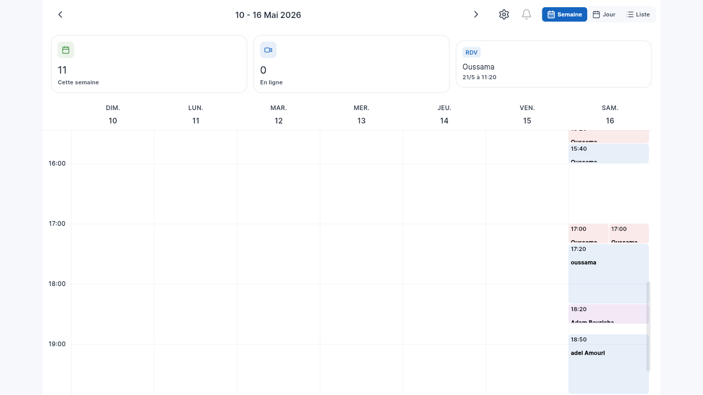

# Eyadati Kit

### Launch your own doctor appointment SaaS with Flutter + Supabase

Production-ready **clinic booking source code** — patient app, doctor dashboard,
scheduling, booking engine and Supabase backend. Built from a real, deployed
clinic SaaS, not a UI template with mock data.

[](https://github.com/eyadati/eyadati-kit-free/actions/workflows/ci.yml)
[](LICENSE)

**[⭐ Get Premium ($199, instant GitHub delivery)](https://eyadati.com/kits/premium)** ·
**[License](#license)** ·
**[What's included](#whats-included)**

<p align="center">
  
</p>

> **Free → Premium.** The free kit is a complete, working clinic booking starter
> you can use commercially. Premium adds payments, reminders, reliability
> tracking, billing and video — and after purchase you're invited to the private
> repository automatically, within minutes.

---

## ⭐ This is not another Flutter UI kit

| Generic `$29` clinic templates | Eyadati Kit |
|---|---|
| 80 screens, mock data | Real booking logic with conflict-safe RPCs |
| "Connect your own backend" | Supabase schema, migrations, RLS, Realtime included |
| No tests | Automated booking-flow + schema tests, CI on every push |
| Unknown architecture | Hexagonal (ports & adapters), Riverpod, GoRouter, Freezed |
| Bought once, abandoned | Extracted from a SaaS in production |

You are buying **engineering work**, not screens. The free repo exists so you
can evaluate exactly that — clone it, read it, run it — before spending a cent.

---

## 📦 What's included

| Area | Details |
|---|---|
| **Auth** | Supabase email/password auth, profile setup, password reset, role routing (doctor / patient). |
| **Doctor side** | Dashboard, appointment calendar (syncfusion), custom schedule with slots, patient history search, profile & practice setup, settings. |
| **Patient side** | Doctor search, doctor profile, booking flow (single + multi-slot), appointment list & details, favorites, profile. |
| **Database** | Supabase PostgreSQL + Realtime. Migrations for `doctors`, `patients`, `profiles`, `appointments`, `schedules`, availability helpers. |
| **Edge functions** | Booking RPCs (`book_appointment`, `available_slots_v2`, …), `delete-account`, `patient-reset-password`. |
| **Backend** | **Your own Supabase project** — set `SUPABASE_URL` / `SUPABASE_ANON_KEY`. No proprietary backend, no lock-in. |
| **Adapters** | `MockPaymentAdapter`, `MockSmsAdapter`, `MockPushAdapter` behind stable ports (see below). |

## ✅ Free vs Premium

|  | Free | Premium |
|---|:---:|:---:|
| Patient authentication & booking | ✅ | ✅ |
| Doctor calendar & scheduling | ✅ | ✅ |
| Availability engine (conflict-safe booking RPCs) | ✅ | ✅ |
| Supabase backend (migrations, RLS, Realtime) | ✅ | ✅ |
| Multi-slot booking, favorites, patient history | ✅ | ✅ |
| Mock payment / SMS / push adapters | ✅ | ✅ |
| Automated tests + CI | ✅ | ✅ |
| Real payment integration (Chargily checkout, webhooks) | — | ✅ |
| SMS + push reminders (cron-driven) | — | ✅ |
| No-show tracking & patient reliability score | — | ✅ |
| Visit notes & call logs | — | ✅ |
| SaaS billing / subscriptions for your doctors | — | ✅ |
| Video consultations | — | ✅ |
| Real Chargily / Twilio / FCM adapters | — | ✅ |
| Multi-doctor clinics | — | Roadmap |

> **Free gets you a booking application. Premium gets you the infrastructure
> for a clinic SaaS business.**

---

## 📋 Requirements

```text
Flutter 3.11+ / Dart 3.11+
A Supabase project (free tier works)
Git

Optional: Supabase CLI (migrations), Docker (local stack)
```

No proprietary backend required — everything runs on **your** Supabase project.

---

## 🚀 Getting started

### 1. Install

```bash
git clone https://github.com/eyadati/eyadati-kit-free.git
cd eyadati-kit-free
flutter pub get
```

### 2. Configure the backend

```bash
cp .env.example .env
# edit .env — SUPABASE_URL and SUPABASE_ANON_KEY from your Supabase dashboard
```

Then set the compile-time variables (used by `lib/core/config/environment.dart`):

```bash
flutter run -d chrome \
  --dart-define=SUPABASE_URL=https://your-project.supabase.co \
  --dart-define=SUPABASE_ANON_KEY=your-anon-key
```

### 3. Database

Apply the migrations in `supabase/migrations/` to your project, in filename order:

```bash
supabase db push          # or copy them into the SQL editor
```

### 4. Run

```bash
flutter run -d chrome      # web
flutter run                # any device
flutter build web --release
```

---

## 🗺️ Where do I change X?

| I want to change… | Go here |
|---|---|
| Branding, app name, colors | `REBRAND.md`, `lib/l10n/`, `lib/core/theme/` |
| Patient UI | `lib/features/patient/` |
| Doctor UI | `lib/features/doctor/` |
| Booking / availability logic | `lib/repositories/`, `supabase/migrations/` (RPCs) |
| Payment / SMS / push provider | `lib/core/ports/` + `lib/core/infrastructure/` |
| Database schema | `supabase/migrations/` |
| Routes | `lib/core/routing/` |

---

## 🏗️ Architecture

Hexagonal (ports & adapters) with feature-first folders:

```
lib/
├── core/
│   ├── domain/            # entities, value objects, repository interfaces
│   ├── ports/             # PaymentPort, SmsPort, PushPort  ← swap points
│   ├── infrastructure/
│   │   ├── mock/          # free tier: Mock*Adapter (no credentials needed)
│   │   └── premium/       # premium tier: Chargily / Twilio / FCM adapters
│   ├── routing/           # GoRouter + route names
│   ├── providers/         # shared Riverpod providers
│   └── widgets/, theme/, constants/, utils/
├── features/
│   ├── auth/              # sign in / sign up / onboarding
│   ├── doctor/            # calendar, schedule, patients, dashboard, settings
│   └── patient/           # search, booking, appointments, favorites, profile
├── models/                # freezed / json data models
├── repositories/          # Supabase data access
├── services/              # app-level services
└── main.dart
```

State management is **Riverpod** (annotation + codegen), routing is **GoRouter**,
models are **freezed**.

### Why ports & adapters matters to you

Every external capability sits behind an interface, so you can replace the
provider without touching booking or business logic:

```
Booking ──▶ PaymentPort ──▶ ChargilyAdapter   (Premium)
                          ├ StripeAdapter      (yours to add)
                          └ YourAdapter

        ──▶ SmsPort ─────▶ TwilioAdapter       (Premium) / MockSmsAdapter (Free)
        ──▶ PushPort ────▶ FcmPushAdapter      (Premium) / MockPushAdapter (Free)
```

### Swapping an adapter

Replace the registration — nothing else in the app changes:

```dart
// lib/core/ports/payment_port.dart
abstract class PaymentPort {
  Future<String> createCheckout({
    required String planId,
    required String successUrl,
    required String failureUrl,
    Map<String, String>? metadata,
  });
}
```

Free tier ships `MockPaymentAdapter` (prints the checkout request and returns a
URL), `MockSmsAdapter` (logs the message), and `MockPushAdapter` (no-op).

---

## 🧪 Built for real applications

This code comes from a working clinic SaaS, and it is guarded like one:

- **Automated Flutter tests** — unit, repository query-shape, and booking-flow
  integration tests (all against in-memory fakes)
- **SQL schema invariants** run against a real Supabase stack
- **Edge Function type checking** in CI
- **CI on every push** — analyze, test, production web build
- **RLS-enabled** database schema

Full breakdown: [TESTING.md](TESTING.md).

---

## 🌍 Internationalization

The upstream product is Algeria-only; **this kit is not**. Locale-neutral
defaults ship everywhere and are configurable:

- **Phone numbers** — validation accepts international `E.164` (`+15551234567`)
  in addition to Algerian numbers.
- **City list** — `lib/core/constants/app_regions.dart`: replace the default
  list with your region's cities, or switch the field to free text.
- **Languages** — `flutter gen-l10n` (`l10n.yaml`): French (template) + Arabic.
  To add English: create `lib/l10n/app_en.arb` from `app_fr.arb`, run
  `flutter gen-l10n`, add `Locale('en')` to `supportedLocales` in `lib/main.dart`.
- **Payment / SMS / push** — stable ports with mock adapters; swap in any
  provider for your region (see [Swapping an adapter](#swapping-an-adapter)).

---

## 🎨 White-label ready

Buyers don't launch "Eyadati" — they launch **their own brand**. The kit ships
with the upstream name, and [REBRAND.md](REBRAND.md) lists every file to change:
app title, localized strings, colors, metadata. Edit the `.arb` sources and run
`flutter gen-l10n` rather than the generated localization files.

Agencies: use it as the foundation for client projects (see [License](#license)).

---

## 🔓 License

**PolyForm Shield 1.0.0** — free for individuals and commercial use, with a
no-compete restriction. In plain English:

| Question | Answer |
|---|---|
| Use it for my own app / clinic, commercially? | **✅ Yes** |
| Modify the source? | **✅ Yes** |
| Self-host? | **✅ Yes** |
| Resell or redistribute the kit code itself? | **No** |
| Offer Eyadati (or a rebranded Eyadati) as a competing booking service? | **No** |

> Not legal advice — read the full [LICENSE](LICENSE).

---

## ⭐ Upgrade to Premium

Premium is the same codebase plus the production modules:

- **Payments** — Chargily checkout via `PaymentPort`, real webhooks and subscription state
- **Reminders** — SMS + push reminders to patients before appointments
- **Reliability** — no-show tracking, patient attendance rate, booking guards
- **Visit notes & call logs** — per-patient clinical notes, call logging with monthly call count
- **Billing** — plan management for your own end-user doctors
- **Video consultations**
- **Real adapters** — Chargily, Twilio, FCM behind the same ports

**What you receive after purchase:**

1. Complete Paddle checkout (one-time, $199).
2. Your GitHub username (entered at checkout) is verified automatically.
3. The private Premium repository invite arrives at your GitHub account within minutes.
4. Clone, follow the setup guide, start building.

**[Buy Premium →](https://eyadati.com/kits/premium)** — commercial EULA,
delivered from a private repository. Questions: **eyadati.dz@gmail.com**

---

## 💬 Support

Open an issue in this repository.
